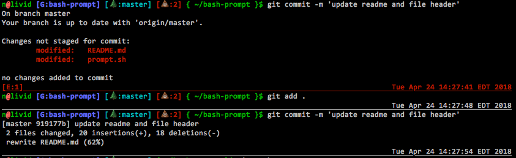

# My dumb bash prompt

Adapted from Dave Vehrs'
[custom_prompt.sh](https://debian-administration.org/article/205/Fancy_Bash_Prompts)
and hacked to add support for git/mercurial repos (show current branch and
dirty file count), per-prompt datestamps, python virtualenvs, and color coding
based on exit value.

## Obligiatory screenshot



## To install

* check this out somewhere
* add to your `.bash_profile`:

```
. ~/<PATH TO>/prompt.sh
```
